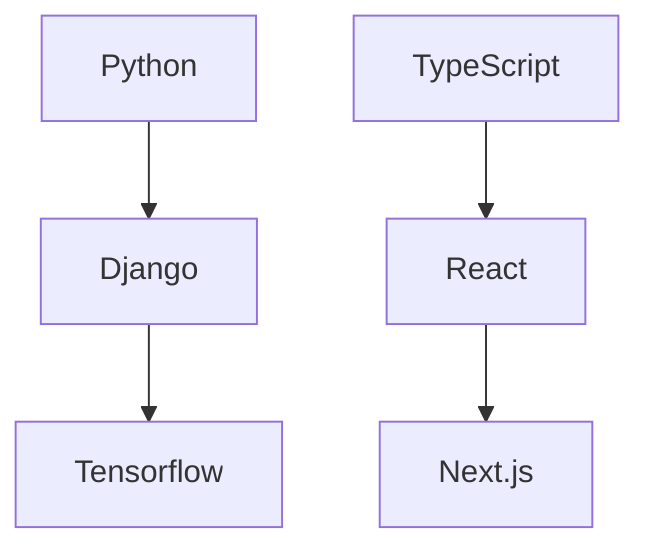

# 👨🏻‍💻小牛叔
 
全栈程序员，致力于创造适合**0基础小白**喜闻乐见的编程入门教程。随着互联网及AI技术飞速进步，小牛叔认为如今写代码并非高深莫测，人人都能成为程序员，人人都必须掌握编程。

### 后端计划
半个月学会Python，1个月内学会网站开发，2个月内学会AI;

### 前端计划
半个月学会TypeScript，1个月内学会框架React + Next.js

```mermaid
graph TD;
Python --> Django --> Tensorflow
TypeScript -->React --> Next.js
```

