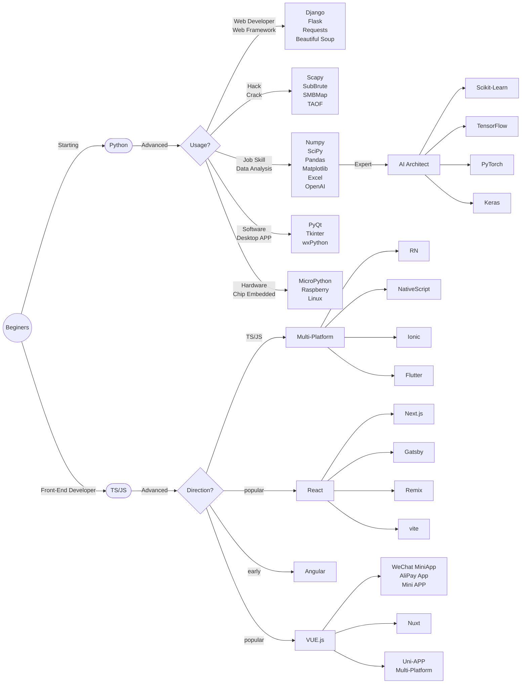

import Image from 'next/image'

# B0 How Beginners with No Experience Should Choose a Starter Language
Beginners to programming often don't know how to choose a programming language. The only real question is: Will I *only* do front-end development in the future?
If not, then start learning Python directly. If you're set on doing front-end development, start with TS/JS (and it's also recommended to learn Python later).

## 1. Python as the First Choice
Python is a back-end, interpreted language that is easy to learn, use, extend, and maintain. It's one of the most popular languages in the world today, with a vast array of third-party libraries. When new technologies like OpenAI are developed, they must release support for Python as soon as possible. Python is used in almost all fields, except for front-end development.

## 2. The Increasing Popularity of Front-End Technology
Front-end technology is becoming increasingly popular, to the extent that front-end development can achieve functions traditionally done by back-end languages. In my view, the essence of front-end development is how to better present and render data in browsers, achieving improved visual effects and interactivity. Front-end development refers to all technical development related to the website user interface, such as desktop web pages, mobile web pages, web pages built into WeChat, and WeChat Mini Programs. Front-end technology is constantly advancing with Node.js and others, and many software and mobile apps that run locally can also be developed with front-end technologies.

Front-end technology uses JavaScript and its derivative, TypeScript.

The chart below guides you in choosing your technical direction.

