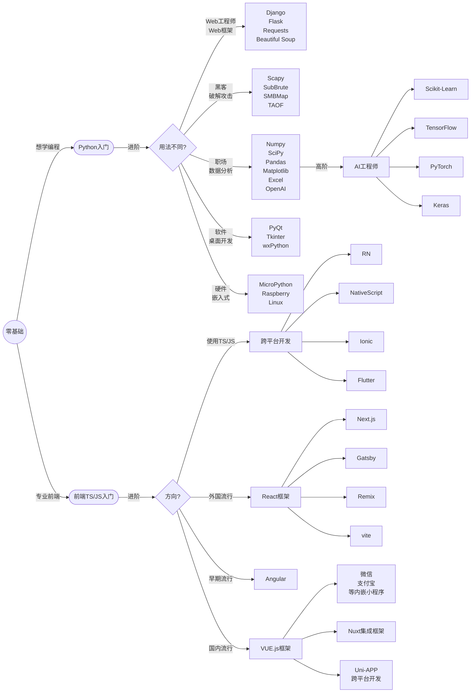

import Image  from 'next/image'

# B0 零基础如何选择入门语言
零基础编程入门的初学者往往不知道如何选择编程语言，其实唯一问题是:我以后是否*只做*前端开发？
如果不是，那么就直接学习Python，如果打定了做前端开发，那么就从TS/JS开始学起（后面也建议学习Python）。

## 1.首选Python
Python是后端开发、解释型语言，它的优点是易于学习、使用、扩展和维护。是目前世界上最流行的语言之一，拥有海量的第三方支持库，最新OpenAI等新技术研发出来时，都必须要第一时间发布支持Python语言的第三方库。除了前端开发外，Python几乎应用在所有领域。

## 2.越来越流行的前端
目前前端技术越来越流行，甚至前端也可以做原本后端语言才能达到的功能。笔者来看，前端开发本质上是如何让数据更好地展示与渲染在浏览器中，从而达到更好视觉效果、互动性。前端开发，指与网站用户界面相关的一切技术开发工作，如PC端网页、移动端网页、微信内置网页、微信小程序。由于前端技术主要是Node.js等不断地攻城略地，很多基于本地运行的软件、手机APP也可以使用前端技术进行开发。

前端技术使用JavaScript和其衍生出来TypeScipt。

下面的图表，教您如果选择自己的技术方向。

