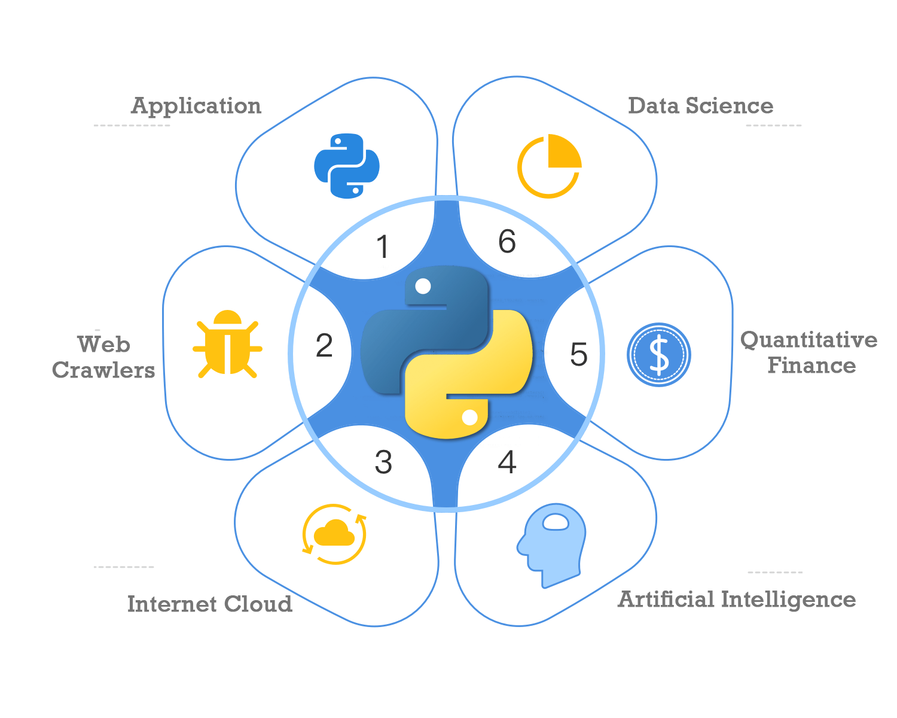

import Image from 'next/image'

# B1 Why Strongly Recommend Starting with Python for Complete Beginners?

Python is elegant, concise, and widely used. These two qualities alone are enough to help beginners quickly get started with programming, ensuring practical knowledge that is hard to become outdated.
> Life is short, I use Python

## 1. Elegance and Conciseness
This is mainly due to the original intention behind Python's creation by its designers, which is reflected in the following aspects:

### 1) Simple Syntax - Elegance
Python's syntax has been designed from the start to be simple and practical, avoiding the piling up of complex concepts, making it easy to understand. It uses common basic English words, such as `if`, `else`, `for`. These statements are straightforward. For example, variable assignment can be done directly without the need for explicit definition, saving a lot of conceptual explanation.
### 2) Readable Format - Conciseness
Python uses enforced indentation, which is neatly arranged and easy to read. Visually, code in the same column can conceptually be understood as being on the same level, avoiding confusion for beginners. There are also special format statements for strings.
### 3) Run Directly - Speed
Python is an interpreted language that can be run with a single click, without the need for complex processes like compilation. Code errors can be debugged directly through running, making it easy to locate problems and facilitating beginners' learning through experimentation.

    <Image src="/images/py_web.png" width="550" height="343" className='rounded-2xl  shadow-xl'/>

    

## 2. Wide Application

Its wide application is due to Python's rich third-party module libraries. The massive support packages make Python a versatile king in programming languages. This is mainly reflected in the following aspects:

    ### 1) AI Artificial Intelligence
    Python is the preferred language for AI, with neural networks like TensorFlow being trained and modeled through Python. Unless you want to write the neural network's source code directly, which must be implemented in C++, even programmers working on the AI development's lower levels will use Python 100% of the time, because processing databases or Excel data with Python is very convenient. Not to mention, the market for big models like Open AI, and Wenxin Yiyan demands their APIs must support Python to have an application market.
    ### 2) Web Development
    Python was famous early on for its internet capabilities, avoiding complex underlying concepts like sockets, network streams, byte encoding. Two lines of code can read information from the internet, making Python a master of web development applications like web scraping, frequently obtaining and quickly organizing big data, which has become an industry standard skill.
    Django, Flask, and other backend frameworks ensure rapid web site development within minutes.
    ### 3) Quantitative Trading
    Python is also the preferred language for quantitative trading applications, mainly due to the comprehensive application of Python's rich third-party component libraries, integrating web scraping, data analysis, data visualization, machine learning, and other components, providing a one-stop solution for obtaining market data, processing analysis, and high-frequency trading functions, making Python an essential tool for quantitative trading.
    ### 4) Hacking Tools
    Python is also the hacker's tool of choice, allowing for quick integration of all other hacking tools, such as command-line scripts, automated browser tasks, quick generation of dictionaries, cracking WIFI passwords, fast encryption and transmission, and quick email sending.

    

    

        

    

